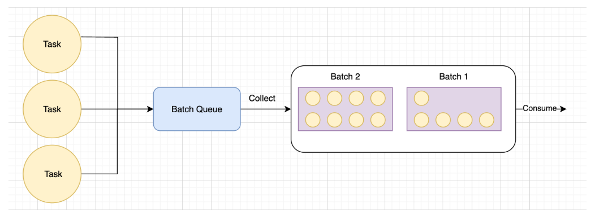

# Batcher Queue — универсальный Batcher (подробное задание)

## Краткая идея

`Batcher Queue` собирает однотипные элементы в пачки (batches) и вызывает пользовательский обработчик для каждой пачки. Вместо обработки каждого элемента по отдельности — мы ждём накопления до `flushSize` элементов или пока не пройдет `interval`, и затем обрабатываем пачку целиком. Это даёт экономию соединений, горутин и увеличивает пропускную способность для массовых обращений к БД/внешним сервисам.

---

## Визуальная схема




---

## Что требуется реализовать (коротко)

Реализовать generic‑структуру `Batcher[T]` со следующим поведением:

* Накопление элементов через `Add(items ...T)`.
* Фоновая горутина ждёт, пока в буфере не окажется `capacity` элементов **ИЛИ** не пройдёт `interval` — затем передаёт пачку в `handler`.
* `Close()` завершает батчер: блокирует приём новых элементов, сбрасывает остаток в handler и ждёт завершения всех запущенных handler'ов.

Реализация должна находиться в файле `./batcher/batcher_queue.go` и проходить тесты в проекте.

---

## API (обязательные сигнатуры)

```go
// Handler — функция, вызываемая при накоплении батча.
type Handler[T any] func([]T)

// Batcher накапливает элементы и отдает их пачкой.
type Batcher[T any] struct {
}
// NewBatcher создает новый Batcher.
//
//   - capacity — максимальное количество элементов в батче (flushSize),
//   - interval — максимальное время ожидания перед сбросом.
//   - handler - пользовательский обработчик пачки
func NewBatcher[T any](capacity int, interval time.Duration, handler Handler[T]) *Batcher[T] {
    return &Batcher[T]{}
}

// Add добавляет элемент(ы) в батчер.
func (b *Batcher[T]) Add(items ...T) {

}

// Close завершает батчер с сохранением оставшихся элементов.
// Ожидает завершения всех handler'ов.
func (b *Batcher[T]) Close() {

}
```

---

## Поведение (подробнее)

1. `NewBatcher` запускает управляющую горутину, которая читает входящие элементы, управляет таймером и отправляет пачки в `handler`.
2. `Add(items ...T)` потокобезопасен и может вызываться параллельно.
3. При достижении `capacity` буфер немедленно отправляется в `handler`.
4. Если после последней отправки прошло `interval` и в буфере есть >0 элементов — они отправляются в `handler`.
5. `handler` выполняется асинхронно (в отдельной горутине); `Close()` должен дождаться завершения всех таких вызовов.
6. `Close()` запрещает новые `Add` (элементы, добавленные после `Close`, не должны обрабатываться).

---

## Рекомендации по реализации

* Используйте `chan T` или `chan []T` для передачи данных во внутреннюю горутину; альтернативно — `sync.Mutex` + срез.
* Для таймера удобно `time.NewTimer` и сброс таймера при отправке пачки.
* Для ожидания всех handler'ов — `sync.WaitGroup`.
* Для состояния закрытия — `sync.Mutex` + `closed bool` или `atomic.Bool`.
* При отправке в handler передавайте копию среза (новый срез), чтобы избежать гонок.
* `Add` не должен блокировать долго — лучше буферизовать входящие в канал.

---

## Что обычно проверяют в тестах

* Пачки отправляются при достижении `capacity`.
* Пачки отправляются по таймеру (`interval`).
* Поведение при concurrent `Add`.
* `Close()` сбрасывает остаток и ждёт обработчиков.
* `Add` после `Close` игнорируется.
* Нет утечек горутин.


---

## Короткий чек‑лист для сдачи

* `go test ./...` проходит (и по возможности `go test -race`).
* `./batcher/batcher_queue.go` реализован и соответствует API.
* Корректная обработка concurrent `Add` и `Close`.
* Изображение схемы присутствует в `tech_sp.md` и подгружается через `./data/img/BatcherQueue.png`.
